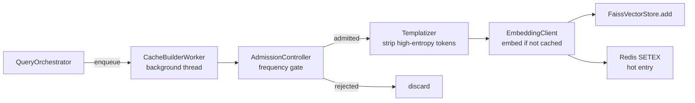

# Async Write Path

After a cache miss and LLM response, the result is indexed asynchronously. This ensures **writes never block the query response path**.

## Architecture



## CacheBuilderWorker

The worker runs as a single background thread started at server init. It owns a `std::queue` protected by a `std::mutex` + `std::condition_variable`:

```cpp
void CacheBuilderWorker::enqueue(const CacheEntryRequest& req) {
    {
        std::lock_guard lock(mutex_);
        queue_.push(req);
    }
    cv_.notify_one();  // wake worker thread
}
```

The orchestrator calls `enqueue()` and returns the HTTP response immediately. The worker processes entries at its own pace.

### Redis Stream Integration

Each admitted entry is also published to the Redis Stream `cache:build:events`. This provides a durable audit trail and allows external consumers (e.g. analytics pipelines) to observe what was cached and when.

## Templatizer

Before indexing, the `Templatizer` replaces high-entropy tokens in the response with `{{SLOT_N}}` placeholders. This makes stored responses reusable across instances of the same pattern.

**Patterns replaced:**

| Pattern | Example input | Stored as |
|---|---|---|
| UUIDs | `order-id: 550e8400-e29b-41d4-a716` | `order-id: {{SLOT_0}}` |
| Numeric IDs | `booking #483920` | `booking #{{SLOT_1}}` |
| Email addresses | `contact us at bob@example.com` | `contact us at {{SLOT_2}}` |
| ISO dates | `ships on 2025-03-21` | `ships on {{SLOT_3}}` |
| Monetary values | `your refund of $49.99` | `your refund of {{SLOT_4}}` |

**Example:**

```
LLM response:
  "Your order #483920 placed on 2025-03-18 will be refunded to
   alice@example.com within 5–7 business days."

After templatization:
  "Your order #{{SLOT_0}} placed on {{SLOT_1}} will be refunded to
   {{SLOT_2}} within 5–7 business days."
```

The templatized form is what gets stored in FAISS and returned on cache hits. This is intentional — the specific values (order number, email) belong to the original user and should not leak to other users' sessions.

!!! warning "Template slot filling"
    The current implementation stores and returns the templatized form. Slot re-filling (substituting the requesting user's values back in) is a planned Phase 4 feature.

## Deduplication

Before writing to FAISS, the worker checks whether the entry's `id` (derived from `hash(query + context_signature)`) already exists in the index metadata map. If it does, the write is skipped silently.

## Queue Depth Monitoring

The current queue depth is visible via `GET /health` and `GET /stats`:

```json
{
  "queue_depth": 7
}
```

A sustained high queue depth indicates the worker cannot keep up with LLM call volume. In this case, consider increasing admission thresholds or adding a second worker thread.
