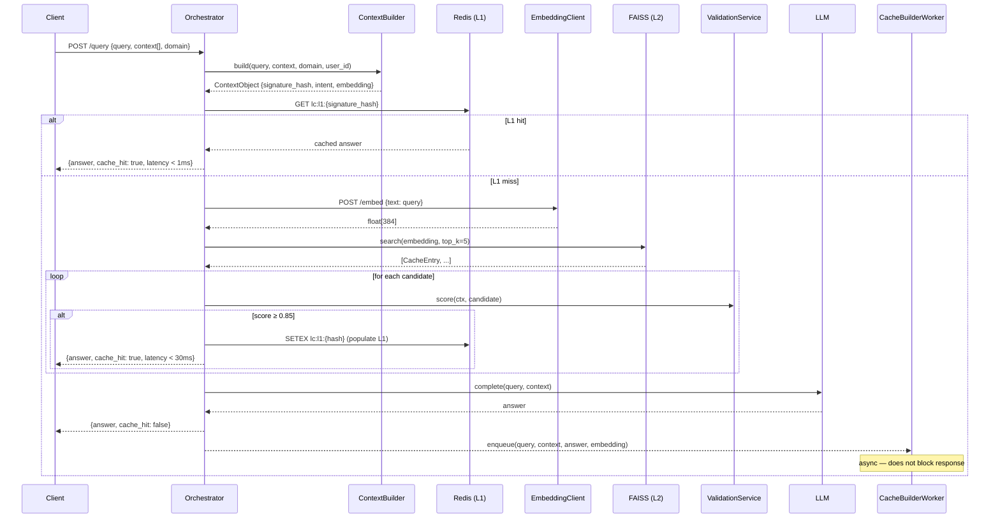

# How It Works

LettuceCache intercepts every LLM query and runs it through a two-layer lookup before making any API call.

## The Hot Path



## The Two Cache Layers

### L1 — Redis Exact Match

The first check is an exact key lookup in Redis. The key is:

```
lc:l1:{SHA-256(intent:domain:anon_user_scope)}
```

If the context signature and domain match exactly, the answer is returned in **< 1 ms** — no embedding, no vector search.

L1 is also populated retroactively: when L2 finds a hit, it writes the result into L1 so the next identical request never touches FAISS.

### L2 — FAISS Semantic Search

When L1 misses, the query is embedded (via the Python sidecar) and searched against the FAISS IVF+PQ index. FAISS returns the top-5 nearest neighbours by cosine distance. Each candidate is then passed to the `ValidationService` which applies the weighted composite score:

```
score = 0.60 × cosine_similarity
      + 0.25 × context_signature_match
      + 0.15 × domain_match
```

The first candidate with `score ≥ 0.85` is returned. If none qualify, the LLM is called.

## The Async Write Path

After an LLM response, the result is enqueued to the `CacheBuilderWorker` — a background thread that processes writes without blocking the response. The worker:

1. Runs the entry through `AdmissionController` (frequency gate)
2. Templatizes the response (strips PII / high-entropy tokens)
3. Embeds the query if not already embedded
4. Writes to FAISS and Redis

See [Async Write Path](async-write-path.md) for details.

## Key Design Properties

!!! success "No false hits on context mismatch"
    The context signature (`SHA-256(intent:domain:anon_user_scope)`) must match for L1 to hit. For L2, the context signature accounts for 25% of the validation score — a mismatch caps the maximum achievable score at 0.75, safely below the 0.85 threshold.

!!! info "Writes never block reads"
    The `CacheBuilderWorker` runs on a separate thread with a `std::condition_variable` queue. The orchestrator calls `enqueue()` and returns the HTTP response immediately — write latency is zero from the client's perspective.

!!! tip "Stateless orchestrator"
    The caller passes the full `context[]` array on every request. No server-side session state is maintained, which means the orchestrator scales horizontally with no synchronization overhead.

!!! abstract "Privacy by design"
    `user_id` is hashed to a 16-character anonymous scope token before use and never persisted. Raw query text is never stored in FAISS — only embeddings and templatized responses with high-entropy tokens stripped.
