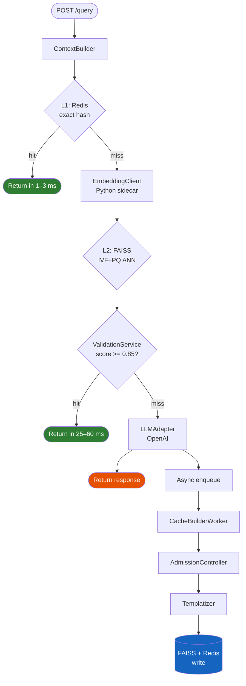

# LettuceCache

**Context-aware semantic cache for LLMs.**
Stops redundant API calls without false hits — because the same question means different things in different conversations.

---

## The Problem

Traditional caching matches on exact query text. Semantic caching matches on query *meaning*. Both still get it wrong in one common scenario:

> **User A** — *"What is the cancellation policy?"* (asking about a hotel booking)
>
> **User B** — *"What is the cancellation policy?"* (asking about a gym membership)

These queries are identical in text and nearly identical in embedding space. A naive semantic cache serves User B the hotel answer — a **false hit** that's worse than a miss.

LettuceCache solves this by encoding the full conversation context into every cache key.

---

## How It's Different

| Approach | Exact text match | Semantic match | Context-aware |
|---|:---:|:---:|:---:|
| Traditional KV cache | ✅ | ❌ | ❌ |
| Semantic cache (embedding only) | ❌ | ✅ | ❌ |
| **LettuceCache** | ✅ | ✅ | ✅ |

---

## Key Numbers

| Metric | Value |
|---|---|
| L1 cache latency (Redis exact match) | 1–3 ms |
| L2 embedding latency (Python sidecar, CPU) | 20–50 ms |
| L2 FAISS search latency | 1–3 ms |
| End-to-end L1 hit | **1–3 ms** |
| End-to-end L2 hit | **25–60 ms** |
| LLM call baseline | 500–2000 ms |
| Validation threshold | 0.85 (configurable) |
| Embedding model | `all-MiniLM-L6-v2` (384 dims) |

---

## Quick Look

```bash
# Start everything
docker compose up

# First call — LLM is invoked, result cached
curl -s -X POST http://localhost:8080/query \
  -H 'Content-Type: application/json' \
  -d '{
    "query": "What is the return policy?",
    "context": ["I bought a jacket last week"],
    "domain": "ecommerce"
  }' | jq .
```

```json
{ "cache_hit": false, "latency_ms": 843, "answer": "..." }
```

```bash
# Second call — served from cache
curl -s -X POST http://localhost:8080/query \
  -H 'Content-Type: application/json' \
  -d '{
    "query": "What is the return policy?",
    "context": ["I bought a jacket last week"],
    "domain": "ecommerce"
  }' | jq .
```

```json
{ "cache_hit": true, "confidence": 0.94, "latency_ms": 47, "answer": "..." }
```

```bash
# Same query, different context — correctly misses
curl -s -X POST http://localhost:8080/query \
  -H 'Content-Type: application/json' \
  -d '{
    "query": "What is the return policy?",
    "context": ["I signed up for the gym yesterday"],
    "domain": "fitness"
  }' | jq .
```

```json
{ "cache_hit": false, "latency_ms": 761, "answer": "..." }
```

---

## Architecture at a Glance



---

## Get Started

<div class="lc-cards">
  <a class="lc-card" href="getting-started/quickstart/">
    <div class="lc-card-icon">🚀</div>
    <div class="lc-card-title">Quick Start</div>
    <div class="lc-card-body">Up and running in 5 minutes with Docker Compose.</div>
  </a>
  <a class="lc-card" href="getting-started/configuration/">
    <div class="lc-card-icon">⚙️</div>
    <div class="lc-card-title">Configuration</div>
    <div class="lc-card-body">All environment variables and tunable parameters explained.</div>
  </a>
  <a class="lc-card" href="how-it-works/overview/">
    <div class="lc-card-icon">🧠</div>
    <div class="lc-card-title">How It Works</div>
    <div class="lc-card-body">Deep dive into context signatures, scoring, and the async write path.</div>
  </a>
  <a class="lc-card" href="api/endpoints/">
    <div class="lc-card-icon">📡</div>
    <div class="lc-card-title">API Reference</div>
    <div class="lc-card-body">Every endpoint, field, status code, and response example.</div>
  </a>
</div>
