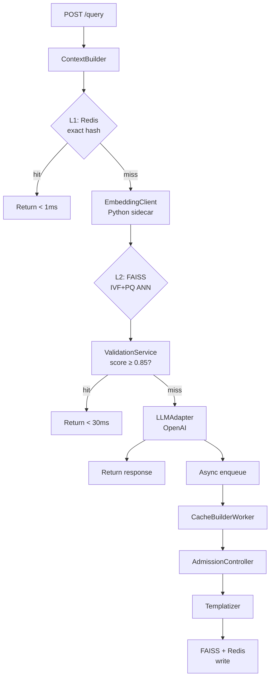

# LettuceCache

<div align="center">
  <p><strong>Context-aware semantic cache for LLMs.</strong><br>
  Stops redundant API calls without false hits — because the same question means different things in different conversations.</p>
</div>

---

## The Problem

Traditional caching matches on exact query text. Semantic caching matches on query *meaning*. Both still get it wrong in one common scenario:

> **User A** — "What is the cancellation policy?" (asking about a hotel booking)
> **User B** — "What is the cancellation policy?" (asking about a gym membership)

These queries are identical in text and nearly identical in embedding space. A naive cache would serve User B the hotel answer — a **false hit**.

LettuceCache solves this by encoding the full conversation context into every cache key.

---

## How It's Different

| Approach | Exact text match | Semantic match | Context-aware |
|---|:---:|:---:|:---:|
| Traditional KV cache | ✅ | ❌ | ❌ |
| Semantic cache (embedding only) | ❌ | ✅ | ❌ |
| **LettuceCache** | ✅ | ✅ | ✅ |

---

## Key Numbers

| Metric | Value |
|---|---|
| L1 cache latency (Redis) | < 1 ms |
| L2 cache latency (FAISS) | 5–10 ms |
| End-to-end cache hit | < 30 ms |
| LLM call baseline | 500–2000 ms |
| Validation threshold | 0.85 (configurable) |
| Embedding model | `all-MiniLM-L6-v2` (384 dims) |

---

## Quick Look

```bash
# Start everything
docker compose up

# First call — LLM is invoked, result cached
curl -s -X POST http://localhost:8080/query \
  -H 'Content-Type: application/json' \
  -d '{
    "query": "What is the return policy?",
    "context": ["I bought a jacket last week"],
    "domain": "ecommerce"
  }' | jq .
# → { "cache_hit": false, "latency_ms": 843, ... }

# Second call — served from cache in < 30ms
curl -s -X POST http://localhost:8080/query \
  -H 'Content-Type: application/json' \
  -d '{
    "query": "What is the return policy?",
    "context": ["I bought a jacket last week"],
    "domain": "ecommerce"
  }' | jq .
# → { "cache_hit": true, "confidence": 0.94, "latency_ms": 22, ... }

# Same query, different context — correctly misses
curl -s -X POST http://localhost:8080/query \
  -H 'Content-Type: application/json' \
  -d '{
    "query": "What is the return policy?",
    "context": ["I signed up for the gym yesterday"],
    "domain": "fitness"
  }' | jq .
# → { "cache_hit": false, "latency_ms": 761, ... }
```

---

## Architecture at a Glance



---

## Get Started

<div class="grid cards" markdown>

- :material-rocket-launch: **[Quick Start](getting-started/quickstart.md)**
  Up and running in 5 minutes with Docker Compose.

- :material-cog: **[Configuration](getting-started/configuration.md)**
  All environment variables explained.

- :material-brain: **[How It Works](how-it-works/overview.md)**
  Deep dive into context signatures, scoring, and the async write path.

- :material-api: **[API Reference](api/endpoints.md)**
  Every endpoint, field, and response code.

</div>
